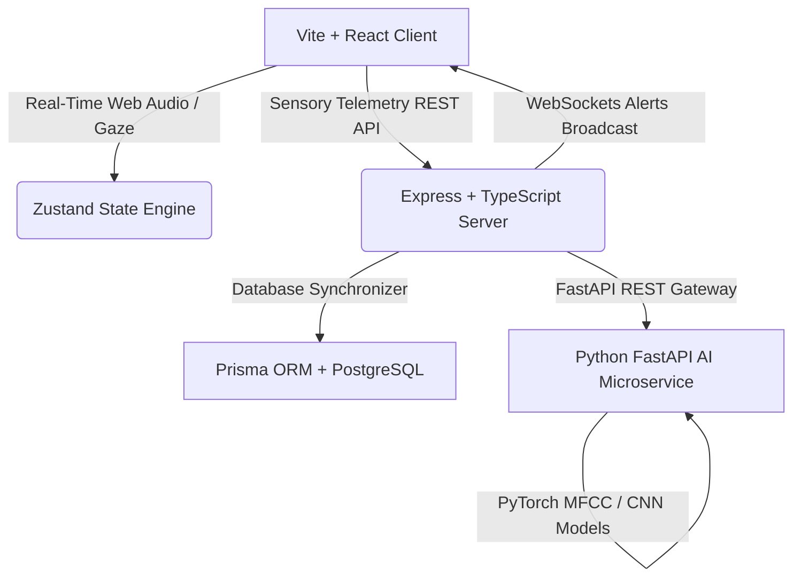
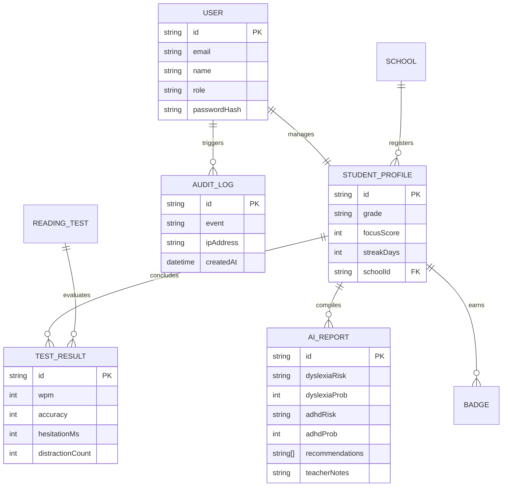

# NeuroLearn — AI-Powered Learning Difficulty Detection & Support Platform

NeuroLearn is a production-grade, research-level web platform designed to screen, identify, and support early-stage indicators of **Dyslexia**, **ADHD-like attention issues**, **reading difficulties**, and **cognitive learning stress**. 

---

## 1. System Architecture

NeuroLearn utilizes a multi-modal monorepo design separating visual presentation, transactional databases, and fast machine learning model inference:



* **Frontend (`/frontend`)**: Responsive single page React app incorporating custom canvas Web Audio oscilloscopes, real keydown interval matrices, and MediaPipe-ready calibration eye overlay filters.
* **Backend (`/backend`)**: Robust REST + WebSocket server managing database transaction pathways, user JWT authorizations, rate limiting, and real-time alert broadcasts.
* **AI Service (`/ai-service`)**: Python FastAPI server detailing deep learning inference loops (convolutional eye focal vectors, keyflight recurrent neural nets, MFCC acoustic speech fluency scorers).

---

## 2. Multi-Modal AI Pipeline Explanation

NeuroLearn combines three physical sensory interaction metrics to build a complete cognitive focus topology:

### A. Speech Fluency Pipeline
```text
[Live Mic Raw Bytes] ──> [Web Audio API Analyser] ──> [Librosa Speech Pacing MFCCs] ──> [Hesitation Pause Tracker] ──> [Fluency Index %]
```

### B. Keystroke Dynamics Pipeline
```text
[Keydown / Keyup Events] ──> [Dwell Hold Durations] ──> [Flight Inter-Key Delays] ──> [Mirror Character confused (b/d)] ──> [RNN Risk Tier]
```

### C. Webcam Gaze Attention Pipeline
```text
[Browser Video Feed] ──> [MediaPipe Facial Coordinates] ──> [Iris Coordinate Vector Trace] ──> [Displacement Variance Bounds] ──> [Attention Score]
```

---

## 3. Database Entity Relationship (ER) Diagram

Scaled to track multiple institutional users, tests, and active audit trail metrics:



---

## 4. API Reference Documentation

### A. Authentication Core Paths
* `POST /api/auth/login` - Authenticate user credentials and return JWT active authorization token.
* `POST /api/auth/register` - Create user profile and link to corresponding school register bounds.

### B. Screening Data Submissions
* `POST /api/screenings/submit` - Save captured keyflight delays, speech pause lengths, and webcam deviation counts.
  * *Request Headers*: `Authorization: Bearer <JWT>`
  * *Payload*:
    ```json
    {
      "studentId": "student-2",
      "testId": "test-1",
      "wpm": 76,
      "accuracy": 82,
      "hesitationMs": 310,
      "distractionCount": 4,
      "speechScore": 90
    }
    ```

### C. AI Inference Gateway
* `POST /ai/predict/dyslexia` - Fast classification of typing dynamics hesitation vectors.
* `POST /ai/predict/adhd` - Convolutional analysis of eye gaze displacement variance plots.

---

## 5. Deployment Instructions

### A. Frontend (Vite Client)
1. Navigate to `/frontend` and run `npm install`.
2. Launch client via `npm run dev` to start dev server on `http://localhost:3000`.
3. To build clean compiled static packages: `npm run build`.

### B. Backend (Express Node.js)
1. Navigate to `/backend` and install packages via `npm install`.
2. Spin up postgres docker cluster or cloud instance, configure `.env` database URL variables.
3. Align models schemas via Prisma CLI: `npx prisma db push`.
4. Boot up development server: `npm run dev`.

### C. AI FastAPI Service (Python)
1. Navigate to `/ai-service` and set up python virtual environments.
2. Install requirement libraries: `pip install -r requirements.txt`.
3. Launch FastAPI server cluster: `uvicorn main:app --reload --port 8000`.
